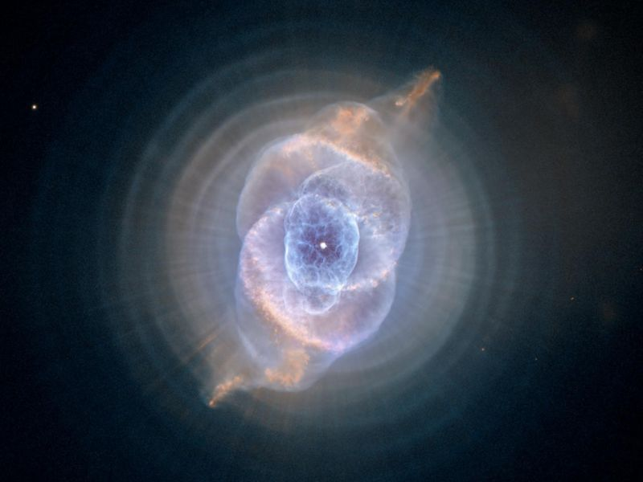
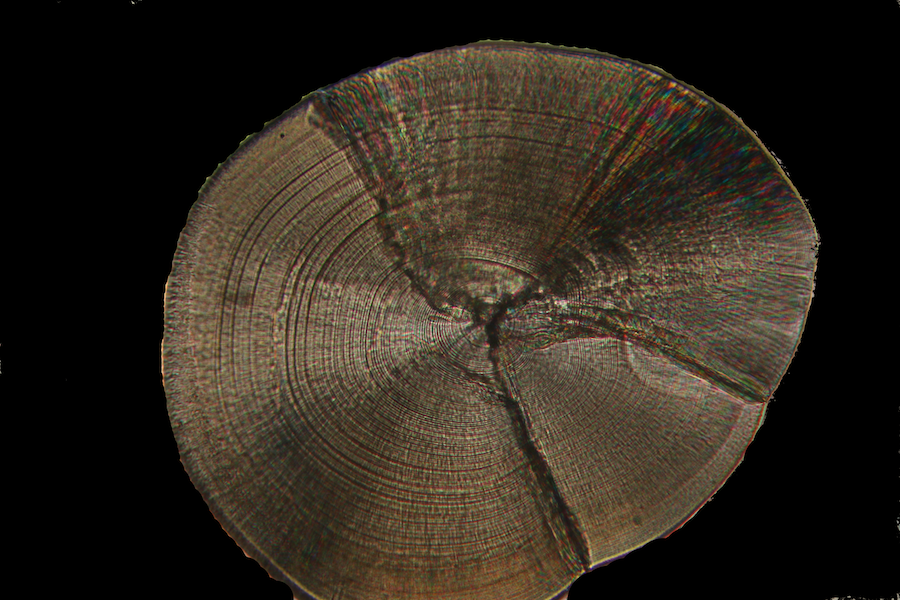

<!-- README.md is generated from README.Rmd. Please edit that file -->
Nebula
======

<!-- badges: start -->
[](https://travis-ci.org/condwanaland/nebula) [](https://www.repostatus.org/#wip) <!-- badges: end -->

> Rings on a nebula, like rings on an otolith...


<p class="caption">
Nebula image from NASA Jet Propulsion Laboratory: <https://www.jpl.nasa.gov/spaceimages/details.php?id=PIA16009&fbclid=IwAR2yfUVgfTlb-MviSoTz8AGCXzXoT4CF7EabSdVtq1hjMJF9c2NmtA62mTg>
</p>

Installation
------------

Nebula is still a work in progress, and there is no current stable version available. You're welcome to download the current devel version from github with:

``` r
devtools::install_github("condwanaland/nebula")
```

Once downloaded, the app can be started with `nebula::nebula()`
